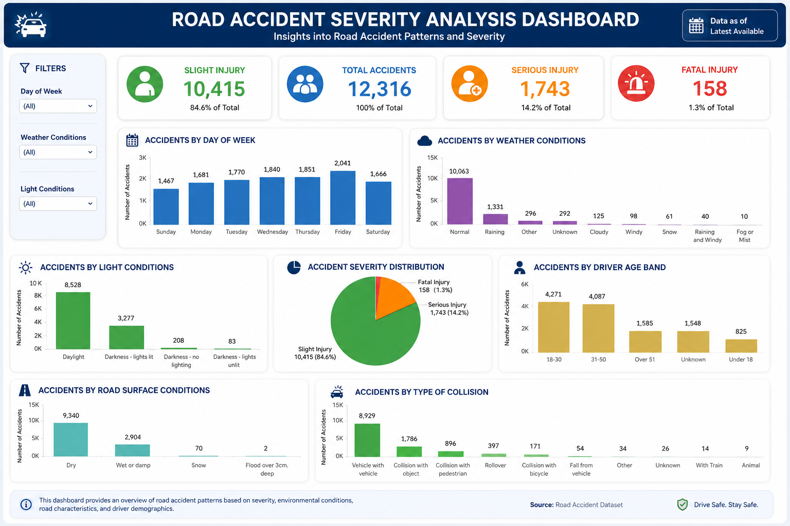

# 🚗 Road Accident Severity Prediction Using Machine Learning and Tableau

## 🚀 Live Demo

Streamlit App:
(Add your Streamlit link here after deployment)

---

## 📌 Project Overview

The **Road Accident Severity Prediction System** is a Machine Learning project developed to predict the severity of road accidents based on various accident-related factors. The system analyzes accident data using multiple machine learning algorithms and predicts whether an accident is **Slight**, **Serious**, or **Fatal**.

The project also includes an interactive **Tableau dashboard** that provides insights into accident trends, contributing factors, weather conditions, road conditions, and accident severity patterns.

---

## 🎯 Objectives

- Predict road accident severity using Machine Learning.
- Analyze accident-related factors affecting severity.
- Compare multiple Machine Learning algorithms.
- Visualize accident insights using Tableau.
- Develop a user-friendly prediction system using Streamlit.

---

## 📂 Dataset Description

The dataset contains road accident records with driver, vehicle, road, and environmental information.

### Features

- Driver Age Band
- Driver Gender
- Educational Level
- Driving Experience
- Vehicle Type
- Road Surface Conditions
- Weather Conditions
- Light Conditions
- Number of Vehicles Involved
- Number of Casualties
- Cause of Accident
- Area of Accident
- Accident Severity (Target Variable)

---

## ⚙️ Data Preprocessing

The following preprocessing steps were performed:

- Data cleaning
- Handling missing values
- Removing unnecessary columns
- Label Encoding of categorical features
- Feature Selection
- Train-Test Split
- Data preparation for Machine Learning

---

## 🤖 Machine Learning Models

The following algorithms were trained and compared:

- Logistic Regression
- Decision Tree
- Random Forest
- K-Nearest Neighbors (KNN)

### Best Model

Random Forest was selected as the final model due to its high prediction accuracy.

---

## 📊 Model Performance

| Model | Accuracy |
|-------|---------:|
| Random Forest | 84.74% |
| Logistic Regression | 84.66% |
| K-Nearest Neighbors | 84.09% |
| Decision Tree | 77.64% |

---

## 🛠 Technologies Used

### Programming Language

- Python

### Libraries

- Pandas
- NumPy
- Scikit-learn
- Matplotlib

### Machine Learning

- Classification Algorithms
- Data Preprocessing
- Model Evaluation

### Visualization

- Tableau

### Deployment

- Streamlit

---

## 📊 Tableau Dashboard

The Tableau dashboard provides interactive visualizations including:

- Total Accidents
- Accident Severity Distribution
- Weather Condition Analysis
- Road Surface Condition Analysis
- Driver Age Analysis
- Vehicle Type Distribution
- Casualty Analysis
- Time-based Accident Trends

---

## 📁 Project Structure

```
Road-Accident-Severity-Prediction-ML-Tableau/
│
├── Road_Accident_Severity_Prediction.ipynb
├── app.py
├── best_road_accident_severity_model.pkl
├── cleaned_road_accident_data.csv
├── Road.csv
├── streamlit_test_input.csv
├── predicted_accident_severity.csv
├── Tableau_Dashboard.png
├── Road_Accident_Severity_Report.pdf
├── Road_Accident_Severity_Presentation.pdf
├── README.md
└── requirements.txt
```

---

## 📷 Tableau Dashboard



---

## 🚀 Future Improvements

- Improve model accuracy using advanced algorithms.
- Deploy using Docker.
- Integrate real-time accident prediction.
- Enhance dashboard with live data.

---

## 👩‍💻 Developed By

**Niba Nasrin**

Machine Learning | Data Analytics | Tableau | Python | Streamlit
